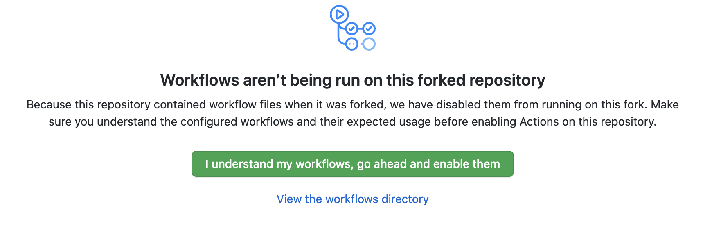

# Coding Home Assignments Prerequisites
Please go over the mandatory prerequisites below.

* [Development Environment](#development-environment)
* [Assignment Guidelines](#assignment-guidelines)

## Development Environment
For all coding assignments in in this course, you will be using a remote environment and a dedicated IDE (VSCode). 

This would spare you the cumbersome process of installing the needed software and tools on your personal PC.

[Click here](https://github.com/ops-school/docs/blob/main/how-to-build-pyhthon-env-guide.md) to learn how to configure your remote environment.

## Assignment Guidelines
* Fork the required Github repository under your Github user name (See [here](https://docs.github.com/en/free-pro-team@latest/github/getting-started-with-github/fork-a-repo) how to fork a repository on Github)
* Go to your forked repo and click on the `Actions` tab found in the repo main page. Click on the green "I understand my workflows. go ahead and enable…" button
        
* For each assignment (or part of the assignment if asked to), you are required to perform your changes and apply the full Pull request flow as described in [OpsSchool home assignment flow](https://github.com/ops-school/docs/blob/main/home-assignments-submission-guide.md).
* Once you create a Pull request on Github, you are only allowed to merge your Pull request when your reviewer has "Approved" your solution (unless mentioned otherwise).
* 
---

